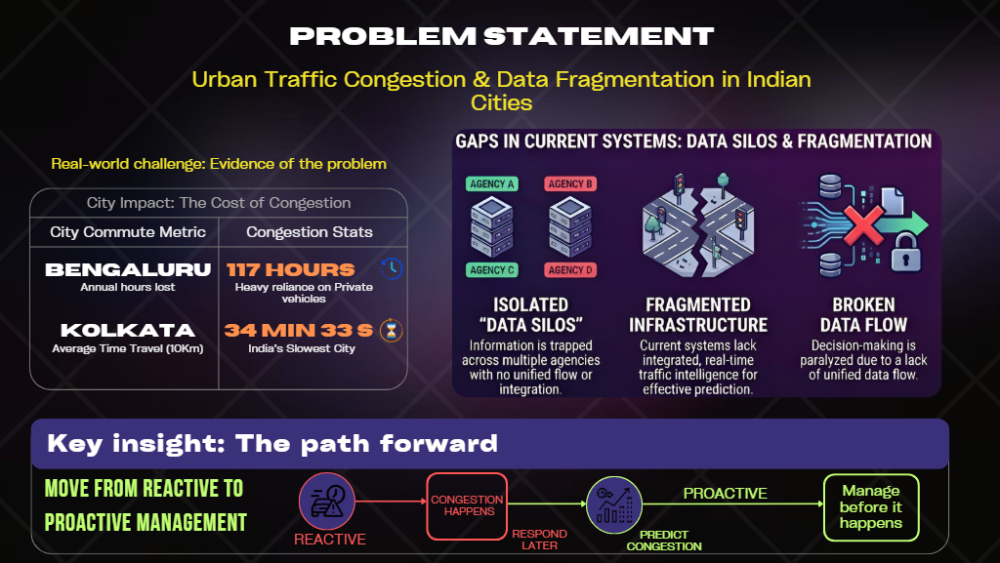
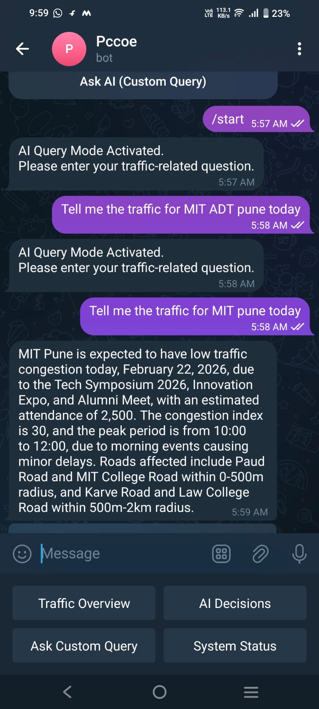
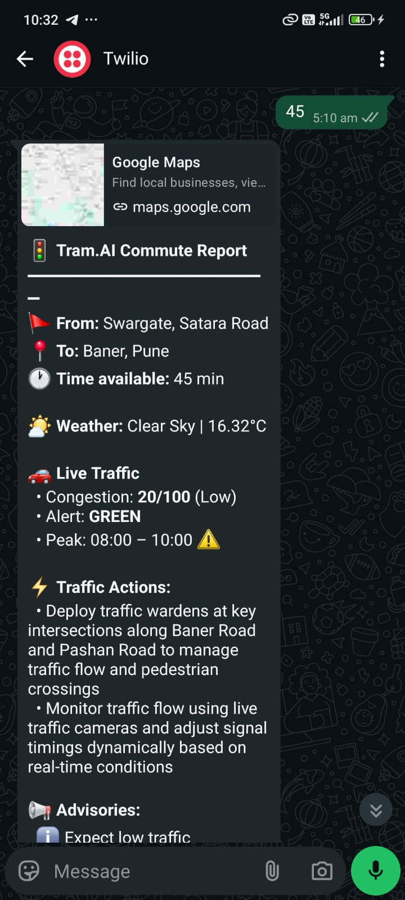
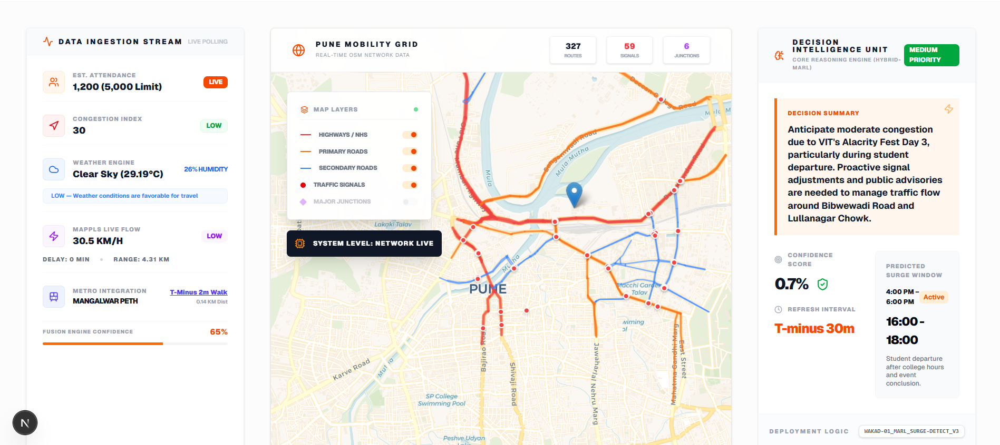
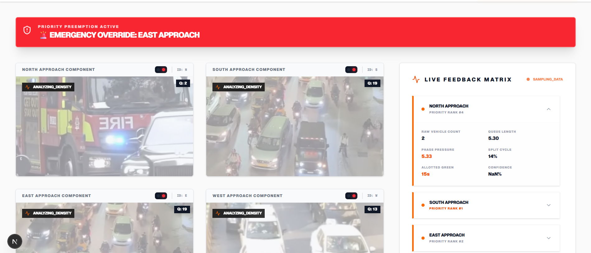

# Blue-BIT-PCCOE

An intelligent, AI-driven urban traffic management and commute planning platform for Pune. Tram.AI combines real-time vehicle detection, dynamic traffic signal optimization, and venue-aware congestion forecasting to reduce commute times and improve traffic flow across the city.

## Overview

TramAI is an intelligent, AI-driven urban traffic management and commute planning platform for Pune. It integrates real-time vehicle detection, dynamic traffic signal optimization, and venue-aware congestion forecasting to reduce commute times and improve traffic flow across the city. The platform combines computer vision, machine learning, and large language models to deliver adaptive route planning for commuters and comprehensive traffic network monitoring for city administrators. It features cross-modal integration of buses, metros, ride-shares, and walking paths, along with sustainability indicators and a mobile PWA interface.

## Features

1. **Smart Commute Planner** – Provides fastest, balanced, and scenic route options with live traffic overlays.

2. **Dynamic Congestion Forecasting** – Uses ML-driven predictions to forecast traffic congestion with hourly heatmaps.

3. **Venue & Event Intelligence** – Estimates event impact on traffic and suggests optimized crowd routing.

4. **Cross-modal Integration** – Integrates buses, metros, ride-shares, and walking paths for seamless travel planning.

5. **Admin Dashboard** – Displays network health, advisories, and tools for incident management.

6. **Mobile PWA** – Lightweight Progressive Web App interface designed for commuters.

7. **Sustainability Indicators** – Shows fuel consumption and emissions estimates for each trip.

## Key Techniques

- **[Asynchronous request handling](https://developer.mozilla.org/en-US/docs/Learn/JavaScript/Asynchronous)** — FastAPI leverages async/await patterns throughout the application stack. Services like `ai_service.py`, `geo_service.py`, and `weather_service.py` make non-blocking I/O calls to external APIs (OpenRouter, Nominatim, weather providers) without blocking request threads. Uvicorn's worker pool handles concurrent requests, enabling the system to manage thousands of commute queries simultaneously while waiting for upstream API responses. Redis acts as both a cache layer (reducing redundant calls) and an async job broker for background tasks like video processing and event data ingestion.

- **[Real-time object detection via YOLO](https://github.com/ultralytics/ultralytics)** — The `VideoProcessor` class in `backend/services/video_processor.py` loads YOLOv8n (nano variant for edge device compatibility) and processes traffic camera feeds at 1-second intervals. Detection output includes bounding boxes with confidence scores. Post-processing classifies detected objects into four categories (cars, motorcycles, buses, trucks), calculates per-lane queue depths, and computes pressure metrics (vehicles upstream minus downstream) that feed directly into the Max-Pressure signal optimization algorithm. Weighted scoring at multiple time horizons (1s, 10s, 60s) provides robust vehicle counts resistant to frame-by-frame noise.

- **[Server-side rendering with React Server Components](https://developer.mozilla.org/en-US/docs/Learn/Tools_and_testing/Understanding_client-side_tools/The_terminal#client-side_vs_server-side_rendering)** — Next.js 16 pages in `frontend/app/` use App Router with Server Components by default. This architecture allows the frontend to offload traffic state computation to the server (via calls to `app/services/`), reducing client-side JavaScript and enabling dynamic route suggestions based on live congestion data before page hydration. Client-side interactive components like route maps and ATCS visualizations (`frontend/components/atcs/`) hydrate lazily using dynamic imports.

- **[Regular expressions for structured data extraction](https://developer.mozilla.org/en-US/docs/Web/JavaScript/Guide/Regular_expressions)** — LLM integrations in `ai_service.py` make requests to Google Gemini and OpenRouter. Since LLMs sometimes output explanatory text alongside JSON, the codebase uses regex patterns (`re.search(r"\{[\s\S]*\}", content)`) to extract JSON blocks reliably. This pattern handles cases where the model returns markdown code blocks or multi-line explanations while guaranteeing valid struct extraction.

- **[Geospatial indexing and proximity queries](https://www.postgresql.org/docs/current/functions-geometry.html)** — PostGIS extends PostgreSQL with spatial data types (Point, Polygon, LineString) and indexed operations. `geo_service.py` uses Nominatim (OpenStreetMap) for reverse geocoding, converting coordinates to venue names. The backend can compute distance-based traffic zones (e.g., "all intersections within 2km of venue X") using `ST_DWithin()` and calculate impact radii for event-triggered congestion zones with sub-millisecond response times via spatial indexes.

- **[Hybrid decision fusion with multi-source context](https://openrouter.ai/)** — The `HybridIntelligence` component in the frontend contrasts two signal optimization approaches: (1) Max-Pressure baseline ensures local throughput maximization via vehicle queue calculations, (2) ML augmentation adds contextual decisions via LLMs analyzing live event data, weather forecasts, and historical patterns. Decisions are fused in `intelligence.py` using weighted scoring, allowing the system to override Max-Pressure when high confidence context (e.g., stadium event with 50k+ attendance forecast) suggests alternative phasing is optimal.

- **[Web scraping and RAG-based venue indexing](https://www.crummy.com/software/BeautifulSoup/)** — The `BACKEND-WEBSCRAPER/` module uses Beautiful Soup to parse HTML from DuckDuckGo search results for live event discovery. Extracted snippets feed into `rag.py`'s retrieval-augmented generation pipeline, building an in-memory or Redis-backed index of venue names, event dates, expected attendance, and historical traffic patterns. When a commuter queries a venue, the RAG system retrieves matching events and context, improving the LLM's venue analysis accuracy.
 

## Technologies & Libraries

**Frontend:**
- [Next.js 16](https://nextjs.org/) — React framework with built-in SSR, automatic code splitting, and API routes.
- [React 19](https://react.dev/) — UI composition with hooks and context for state management.
- [Tailwind CSS 4](https://tailwindcss.com/) — Utility-first CSS framework for rapid component styling.
- [TypeScript 5](https://www.typescriptlang.org/) — Static type checking for JavaScript.

**Backend:**
- [FastAPI 0.115](https://fastapi.tiangolo.com/) — Modern Python web framework with automatic OpenAPI documentation.
- [Uvicorn 0.30](https://www.uvicorn.org/) — ASGI server for serving FastAPI applications.
- [Google Generative AI SDK](https://ai.google.dev/tutorials/python_quickstart) — LLM integration for event analysis and decision-making.
- [OpenRouter](https://openrouter.ai/) — API gateway for accessing multiple LLM providers (Gemini 2.0 Flash).
- [Beautiful Soup 4](https://www.crummy.com/software/BeautifulSoup/) — HTML/XML parsing for web scraping venue and event data.
- [DuckDuckGo Search](https://duckduckgo.com/api) — Decentralized search integration for live event and venue information.
- [python-telegram-bot 22.6](https://python-telegram-bot.readthedocs.io/) — Telegram bot framework for user notifications and commute queries.

**Computer Vision & ML:**
- [YOLOv8](https://docs.ultralytics.com/) — Object detection model for vehicle classification and counting from traffic camera feeds.
- [OpenCV](https://opencv.org/) — Computer vision library for video processing and frame analysis.
- [NumPy](https://numpy.org/) — Numerical computing for traffic calculation arrays and queue metrics.
- [scikit-learn](https://scikit-learn.org/) — Machine learning library for congestion forecasting and anomaly detection.

**Data & Infrastructure:**
- [PostgreSQL](https://www.postgresql.org/) — ACID-compliant relational database for traffic events and commute history.
- [PostGIS](https://postgis.net/) — Spatial database extension for geographic queries.
- [Redis](https://redis.io/) — In-memory data store for caching predictions and broker for async job queues.
- [python-dotenv 1.0](https://github.com/theskumar/python-dotenv) — Environment variable management for API keys and configuration.

## Project Structure

```
Blue-BIT-PCCOE/
├── app/                          # Main FastAPI backend application
│   ├── api/endpoints/            # REST API route handlers
│   │   ├── analyze.py           # Venue and event analysis endpoints
│   │   ├── data.py              # Traffic data and metrics endpoints
│   │   └── map.py               # Map and geospatial visualization endpoints
│   ├── core/                    # Core application configuration
│   │   ├── config.py            # Settings management via environment variables
│   │   └── constants.py         # System prompts and output schemas
│   ├── models/                  # Pydantic data schemas
│   │   └── venue.py             # Venue and event data models
│   ├── services/                # Business logic and integrations
│   │   ├── ai_service.py        # LLM calls for event analysis and decisions
│   │   ├── geo_service.py       # Geocoding and spatial operations
│   │   ├── mappls_service.py    # Mappls routing and map API integration
│   │   ├── metro_service.py     # Metro network and schedule data
│   │   └── weather_service.py   # Weather API integration
│   ├── utils/                   # Utilities and helpers
│   │   ├── file_handler.py      # File I/O operations
│   │   └── logger.py            # Structured logging setup
│   └── main.py                  # FastAPI application entry point
│
├── backend/                      # Video processing and ATCS engine
│   ├── services/
│   │   ├── video_processor.py   # YOLOv8-based vehicle detection and counting
│   │   ├── intelligence.py      # Max-Pressure algorithm and signal optimization
│   │   └── notification.py      # Event-based alerts and messaging
│   ├── routes/
│   │   └── atcs.py              # Adaptive Traffic Control System endpoints
│   ├── yolov8n.pt              # Pre-trained YOLO nano model weights
│   └── main.py                  # Backend service entry point
│
├── BACKEND-WEBSCRAPER/          # Event and venue data ingestion
│   ├── utils/
│   │   ├── main.py              # Scraper orchestration
│   │   └── rag.py               # Retrieval-augmented generation for venue indexing
│   ├── generate_token.py        # API token generation for external services
│   └── output.py                # Parsed venue/event data output
│
├── bot/                         # Messaging integrations for commuters
│   ├── telegram-bot/
│   │   └── telegram_bot.py      # Telegram bot command handlers and conversations
│   └── whatsapp-bot/
│       └── bot.py               # WhatsApp bot integration
│
├── frontend/                    # Next.js React PWA for commuters
│   ├── app/                    # Next.js App Router with main layout and pages
│   ├── components/
│   │   ├── atcs/               # Adaptive Traffic Control System visualizations
│   │   │   ├── HybridIntelligence.tsx      # Max-Pressure vs ML decision comparison
│   │   │   ├── SignalOptimization.tsx      # Signal timing and phase visualization
│   │   │   ├── DataFusionPanel.tsx         # Multi-source data integration display
│   │   │   └── (other ATCS components)     # Performance, scalability, edge cases
│   │   ├── dashboard/          # Traffic analytics and monitoring dashboard
│   │   ├── forecast/           # Congestion forecasting views
│   │   ├── pune_dashboard/     # City-wide traffic overview
│   │   ├── rerouting/          # Route optimization and suggestion UI
│   │   └── ui/                 # Reusable UI components (buttons, cards, etc.)
│   ├── lib/
│   │   ├── atcs_engine.py      # Python ATCS algorithm callable from Next.js
│   │   └── utils.ts            # Frontend utility functions
│   └── public/                 # Static assets (logos, favicons, screenshots)
│
├── static/                      # HTML and media assets
│   └── index.html              # Static HTML entry point
│
└── static DB/                   # Pre-compiled data files
    ├── BUSES_PMPML_DATA.csv    # Pune Municipal Paratransit routes and schedules
    └── pune_metro_stations.json # Metro station locations and connectivity

```

### Key Directories

**`app/`** — Core REST API serving traffic analysis, venue intelligence, and map data. FastAPI automatically generates interactive API documentation at `/docs`.

**`backend/`** — Computer vision pipeline for processing CCTV and traffic camera feeds. The video processor uses YOLOv8n for lightweight real-time vehicle detection, feeding queue lengths into the hybrid intelligence system.

**`BACKEND-WEBSCRAPER/`** — Data ingestion system that scrapes venue schedules, event calendars, and public transit information. RAG-based indexing improves venue matching for contextual traffic prediction.

**`bot/`** — Telegram and WhatsApp bridge enabling commuters to query routes, receive congestion alerts, and get real-time recommendations via messaging platforms.

**`frontend/`** — Next.js PWA providing commuters with route planning, live traffic overlays, and metro/bus integration. ATCS component visualizations help users understand signal optimization decisions.

## Core Features

### Intelligent Route Planning
Commuters enter origin and destination (or venue name), and the platform returns:
- **Fastest route** — Minimizes travel time using live traffic data and congestion forecasts
- **Balanced route** — Trade-off between speed and comfort (fewer transfers, lower stress)
- **Scenic route** — Longer but more pleasant (parks, less congestion, lower emissions)

All routes overlay live traffic heatmaps from the ATCS system and integrate buses, metros, ride-shares, and walking segments. Route updates are pushed in real-time if incidents occur or signal timings change. Backend: endpoints in `frontend/components/rerouting/` call `app/api/endpoints/map.py` → `services/mappls_service.py` for route computation.

### Venue & Event Impact Analysis
When a commuter searches for a venue or the scraper detects a nearby event:
1. **Context Retrieval** — `ai_service.py` calls DuckDuckGo to fetch live event info (concert, sports match, festival)
2. **Event Analysis** — LLM (Gemini 2.0 Flash via OpenRouter) predicts event scale, duration, attendee distribution
3. **Spillback Forecasting** — Estimates which roads will experience congestion, when peak demand occurs, and for how long
4. **Zone Mapping** — PostGIS calculates all intersections within impact radius (e.g., "traffic surge likely 2-5km from stadium")
5. **ATCS Adaptation** — Signal timing adjusts preemptively to handle predicted inflows. Max-Pressure baselines tighten to prevent gridlock in overflow zones.

Results displayed in `frontend/components/dashboard/` showing affected roads, time windows, and recommended rerouting. Confidence levels indicate model certainty.

### Adaptive Traffic Signal Control (ATCS)

A three-layer hybrid intelligence system:

**Layer 1: Max-Pressure Baseline**
- Foundation algorithm in `backend/services/intelligence.py`
- At each intersection, calculates pressure: `P(i) = Queue(upstream) - Queue(downstream)`
- Signal phases optimized to maximize flow on high-pressure approaches
- Guarantees network stability and prevents gridlock via throughput maximization
- Resilient to sensor noise and does not require historical training data

**Layer 2: ML Augmentation**
- Vehicle counts from `VideoProcessor` (YOLOv8) feed queue length estimates
- scikit-learn regression models predict demand 5-30 minutes ahead
- Predictions incorporate weather (rain reduces throughput), time-of-day seasonality
- ML models suggest phase adjustments when confident predictions exist

**Layer 3: Contextual GenAI Fusion**
- When events or incidents occur, `ai_service.py` generates context
- Gemini LLM scores alternative signal timings (e.g., "extend left-turn phase to clear queued buses")
- Final decision merged with Max-Pressure via weighted voting
- Dashboard (`frontend/components/atcs/HybridDecisionBreakdown.tsx`) explains why each decision was made (explainable AI)

Results published to dashboard in real-time. Performance metrics tracked: average delay, intersection saturations, emergency vehicle compliance.

### Real-Time Vehicle Detection

CCTV/traffic camera feeds streamed into `backend/services/video_processor.py`:
- YOLOv8n model (6.3MB, runs on edge hardware) detects vehicles per frame
- Classifies into 4 categories: cars, buses, motorcycles, trucks
- Tracks object IDs across frames to count queue lengths and vehicle flow rates
- Operates at 1-second sampling intervals (reduces computational load while maintaining accuracy)
- Outputs: lane-specific vehicle counts, queue depths, flow speeds

Detections stored in time-series database (or Redis Streams) for historical analysis and ML model training. Dashboard heatmaps display real-time vehicle distribution across the traffic network.

### Congestion Forecasting

ML pipeline predicts traffic patterns for next 1-24 hours:
- **Data inputs** — Historical traffic patterns, weather forecasts, public events, holidays, day-of-week effects
- **Model** — scikit-learn ensemble (Random Forest + Gradient Boosting) trained on Pune traffic data
- **Output** — Hourly congestion heatmaps with 80% confidence intervals, peak period forecasts
- **Refresh** — Updated every 15 minutes as new sensor data arrives

Commuters and transit planners view forecasts in `frontend/components/forecast/`, supporting trip planning and resource allocation. Accuracy tracked and surfaced in admin dashboard.

### Cross-Modal Integration
Route planner integrates all transport modes available in Pune:
- **Buses** — Route data from `static DB/BUSES_PMPML_DATA.csv` (PMPML schedules), real-time location from tracking APIs
- **Metro** — Station coordinates and line topology from `static DB/pune_metro_stations.json`, schedule data from metro authority APIs
- **Ride-shares** — Ola/Uber availability zones and estimated pickup times (via partner APIs)
- **Walking/Cycling** — Generated pedestrian networks and bike lane mappings
- **Auto-rickshaws & 3-wheelers** — India-specific vehicles captured in `frontend/components/atcs/IndiaCentricAdaptation.tsx`

Modular design allows adding new modes. Each mode contributes emissions and comfort scores to route options.

### Commuter Notifications
Telegram and WhatsApp bots (`bot/telegram-bot/telegram_bot.py`, `bot/whatsapp-bot/bot.py`) push:
- Trip alerts — "Incident on your usual route, reroute recommended"
- Signal updates — "Signal timing changed at FC Road intersection, new timing favors your direction"
- Congestion warnings — "Event at Rajiv Park in 30 min, expect 20% longer commute"
- Real-time alternative routes — "Fast lane opens, take this detour"

Conversation state stored in Redis enables multi-turn interactions (user can refine queries without re-entering context). Bot calls backend API endpoints synchronously or via webhook pushes depending on event type.

### Admin Dashboard
Comprehensive monitoring and management tools in `frontend/components/dashboard/`:
- **Network Map** — City-wide view of all managed intersections, live signal states, vehicle counts
- **KPI Trends** — Graphs of average delay, throughput, emissions reduction over time
- **Incident Timeline** — Chronological log of detected problems (gridlock, stuck vehicles, sensor failures)
- **Signal Performance** — Per-intersection efficiency metrics, phase duration audits
- **ATCS Algorithm Transparency** — Side-by-side Max-Pressure vs ML+GenAI decisions with confidence scores
- **Alerts & Escalation** — Configurable thresholds for manual intervention (e.g., alert humans if any intersection saturates >90%)
- **Manual Override** — Authorized admins can temporarily override signal timing for special events or emergencies

Data refreshes via WebSocket subscriptions for low-latency updates.

### India-Centric Adaptations
Traffic patterns in Indian cities differ from Western models:
- **Mixed vehicle types** — Auto-rickshaws and 3-wheelers handled distinctly from cars in queue calculations and signal timing
- **Informal traffic** — Lane discipline is lower; Max-Pressure accounts for spillback and weaving
- **Monsoon impact** — Weather models specifically calibrated for Indian monsoon (high rainfall, waterlogging)
- **Festival and holiday patterns** — Calendar-aware congestion forecasts (Diwali, Ganesh Chaturthi, local events)
- **Public transport subsidies** — Bus and metro encourage modal shift; route planner highlights cost-effective multi-modal options

  ## 👥 Team — METAMASK

| Name | 
|------|
| Vivek Latpate | 
| Shourya Wikhe | 
| Arhant Bagde | 
| Vinit Shirbhate | 


